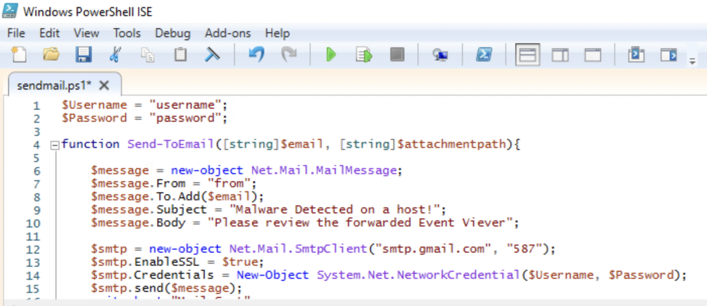
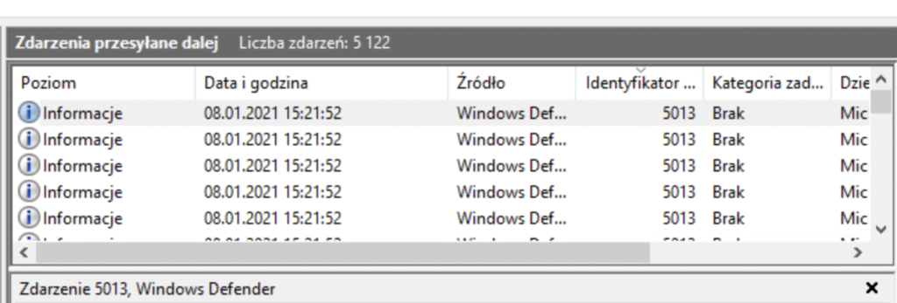
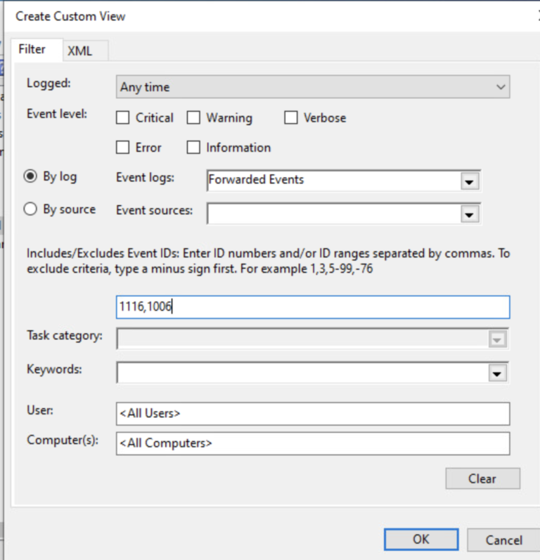

# Microsoft Defender with detection notification per email using windows event forwarding
Windows Event Forwarding (WEF) is a powerful, integrated log forwarding solution build into Windows operating system. In this case, we will use it to extract and collect logs from windows defender, using simple pull (Collector initiated) method. After triggering a specified event ID, a PowerShell script will be initiated sending us an email. I'm using Windows Server 2016 for collecting and Windows 10 as a client, both located in an AD environment.
 I will also include an option to automate the proces using the Group Policy.

# **1. Client side**

**a. WinRM**

We will start with the client. Open the command prompt as administrator and start the winrm service. This will enable forwarding capabilities in the client system.

```
winrm quickconfig
```

Select yes (y) for both, starting the service and allowing a rule in firewall.


**b. WinRM using GPO**

Here's a peak at how to set up a GPO for enabling the service.

Computer Configuration > Preferences > Control Panel Settings > Services > Add


Add a new automatic service, from the name section select the WinRM.


We also need to add a firewall rule.
```
Computer Configuration > Policies > Windows Settings > Security Settings > Windows Firewall with Advanced settings > Inbound rules > New rule
```
Add an allow rule for Windows Remote Management for both public and domain profile.


**c. add Event Log Readers Group**

Next, we need to add the server which is going do collect the events a permission to actually read the events.
 Run computer management as administrator, go to 
 ```
 Local Users and Groups > Groups > Event log readers
```

Select Groups > Event Log Readers > Add


There's a need to add computers to filtered object types, so we can search for our server.


**d. add Event Log Readers Group using GPO**

How to automate it? We will use a PowerShell script. Let's open the PowerShell ISE


```
add-localgroupmember -group "Event Log Readers" -Member "OurDomainName\ServerHostname$";
```
Save it to  **C:\Windows\SYSVOL\sysvol\OurDomainName\scripts**  on our  **Domain Controller**  so it will be visible for other computers and add a new startup script.
```
Computer Configuration > Policies > Windows Settings > Scripts > Startup > PowerShell Scripts > Add
```


# **Server side**

**a. Create Subscription**

Now we will set the server which is going to receive the logs. Open the Event Viewer, go to subscriptions and select 'yes' in the prompt as we want the service to be automatically started.


Create a new Subscription:


In Advanced select Minimize Latency to reduce the [delivery to 30 seconds ](https://docs.microsoft.com/en-us/windows/security/threat-protection/use-windows-event-forwarding-to-assist-in-intrusion-detection#how-frequently-are-wef-events-delivered)


In this proof of concept, we want to receive only logs from Microsoft Defender.
 Select events > XML > and "yes" and paste the following XML

```
<QueryList>
  <Query Id="0" Path="Microsoft-Windows-Windows Defender/Operational">
    <Select Path="Microsoft-Windows-Windows Defender/Operational">*</Select>
  </Query>
</QueryList>
```


After that we can connect our client in Select Computers \&gt; Add Domain Computers. We can also test the connection after adding.


**b. Email notification**

Last but not least, we will use Task Schleuder to trigger a PowerShell script sending us a notification email.

Set the account to SYSTEM and select to Run with highest privileges.


We will select the triggering based on [Microsoft IDs base](https://docs.microsoft.com/en-us/windows/security/threat-protection/microsoft-defender-antivirus/troubleshoot-microsoft-defender-antivirus). Note, that there are two IDs we are interested in – 1006 and 1116. We can only paste one so there will be a need for two Tasks.


Before creating an action, we need to set up our email script.


```
$Username = "username - our email in google";
$Password = "password";

function Send-ToEmail([string]$email, [string]$attachmentpath){

    $message = new-object Net.Mail.MailMessage;
    $message.From = "from";
    $message.To.Add($email);
    $message.Subject = "Malware Detected on a host!";
    $message.Body = "Please review the forwarded Event Viever";

    $smtp = new-object Net.Mail.SmtpClient("smtp.gmail.com", "587");
    $smtp.EnableSSL = $true;
    $smtp.Credentials = New-Object System.Net.NetworkCredential($Username, $Password);
    $smtp.send($message);
    write-host "Mail Sent" ;
 }
Send-ToEmail  -email "paste the receiver email here";
#Send-ToEmail  -email "if you want, we can add a second receiver in the next line";
```


Let&#39;s save it and go back to our Event Schleuder in the Actions tab.



Program should be set to &#39; **powershell**&#39; and in the Argument section paste the path to your saved script
```
-File C:\PATH-to-the-previous-powershell-script.ps1
```
Deselect the AC power option in Conditions tab


And set to run new instance in paralel in settings tab


Now do the same for the second malware found ID – 1116


# **Testing**

Let&#39;s check the connection again, this time we will be using Runtime status. You will use it many times in the future to troubleshoot issues. Everything&#39;s looking alright.


No let&#39;s check the forwarded Event&#39;s tab.
Looks good!



There will be a lot of logs we&#39;re not interested in like a successful definition update, schleuded scan notification etc.
 There&#39;s a need for creating a custom view to filter out the noise.

Select the &#39;create custom view&#39; option


And let&#39;s concentrate only on our two &#39;malware found&#39; IDs.



Let&#39;s try it out! Use the Eicar test file which is used to test anti malware software at eicar.org

Download the zip file and open it. You can safely ignore the SmartScreen warning in this case.


We triggered a detection!


And here are our results (In Polish as I needed to change the language :D)


We also received an email!


# **Conclusion**

The method won&#39;t ever replace a proper managed AV or EDR solution but it&#39;s really fun to make, cost nothing if you&#39;re already using an AD and gives us a little bit of information at what&#39;s going on when we are on a tight tools budget 🙂

# **Resources**

[https://docs.microsoft.com/en-us/windows/security/threat-protection/use-windows-event-forwarding-to-assist-in-intrusion-detection#how-frequently-are-wef-events-delivered](https://docs.microsoft.com/en-us/windows/security/threat-protection/use-windows-event-forwarding-to-assist-in-intrusion-detection#how-frequently-are-wef-events-delivered)

[https://docs.microsoft.com/en-us/windows/security/threat-protection/microsoft-defender-antivirus/troubleshoot-microsoft-defender-antivirus](https://docs.microsoft.com/en-us/windows/security/threat-protection/microsoft-defender-antivirus/troubleshoot-microsoft-defender-antivirus)
